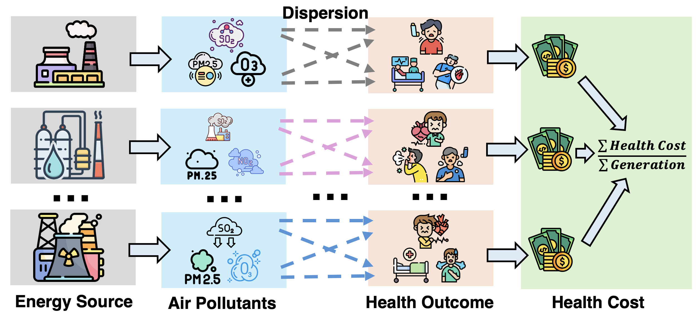

# Predicting Public Health Impacts of Electricity Usage
[](https://opensource.org/licenses/MIT)
[](https://neurips.cc/)

This repository contains the official implementation for the paper [Predicting Public Health Impacts of Electricity Usage](https://github.com/anonymous)

**Authors:** Yejia Liu* (UC Riverside), Zhifeng Wu* (UC Riverside), Pengfei Li (RIT), and Shaolei Ren (UC Riverside)
_* Equal contribution_

**Published at:** The Thirty-Ninth Annual Conference on Neural Information Processing Systems (NeurIPS 2025) Workshop on Socially Responsible and Trustworthy Foundation Models (ResponsibleFM).



-----------------------------
## Table of Contents
- [Overview](#overview)
- [Installation](#installation)
- [Dataset](#dataset-format)
- [Usage](#usage)
- [Model Architecture](#model-architecture)
- [Citation](#citation)
- [License](#license)

## Overview
This project implements a two-stage prediction framework:

- Fuel Mix Prediction: Forecasts future energy source compositions (coal, natural gas, oil, nuclear, renewable)
- Health Impact Predictor: Predicts internal and external health costs based on predicted fuel mixes

## Installation

### Prerequisites
- Python 3.8+
- PyTorch 2.0+
- CUDA (optional, for GPU acceleration)

### Setup
Clone the repository and install dependencies:
```bash
git clone https://github.com/liuyejia/HealthImpactPredictor.git
cd HealthImpactPredictor
pip install -r requirements.txt
```

## Dataset Format
The input CSV file should contain the following columns:
- `Coal_percentage`, `Natural_Gas_percentage`, `Oil_percentage`, `Nuclear_percentage`, `Renewable_percentage` 
- `internal_health_cost`, `external_health_cost`

Example: `CISO_dataset.csv`, `TVA_dataset.csv`

## Usage
### Basic Training

```bash
python main.py --model transformer --T 24 --beta 0.8 --state CISO
```

### Arguments

- `--model`: Model architecture (`transformer` or `lstm`, default: `transformer`)
- `--T`: Prediction time steps (`24` or `72`, default: `24`)
- `--beta`: Weight for fuel mix loss in combined loss function (default: `0.80`)
- `--state`: Dataset identifier (default: `CISO`)

### Example Commands

```bash
# Train with Transformer, 72-hour prediction
python main.py --model transformer --T 72 --beta 0.9 --state CISO

# Train with LSTM, 24-hour prediction
python main.py --model lstm --T 24 --beta 0.8 --state PJM
```

## Model Architecture

- **Fuel Mix Predictor**: Transformer or LSTM encoder-decoder for time-series forecasting
- **Health Impact MLP**: Multi-layer perceptron that maps fuel compositions to health costs

## Citation
If you find this work useful for your research, please cite:
```bibtex
[https://arXiv.com]
```

## License
This project is licensed under the MIT License - see the [LICENSE](LICENSE) file for details.